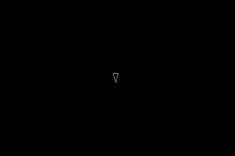

# Asteroid Game

Welcome to the classic Asteroid game recreated in Python using Pygame! This repository contains the source code and necessary files to run the game on your local machine.

## Installation

To run the game, follow these steps:

1. Clone the repository:

```bash
git clone https://github.com/gesch97/asteroids
cd asteroids
```

2. Create a virtual environment:

```bash
python -m venv venv
```

3. Activate the virtual environment:

- On Windows:

```bash
venv\Scripts\activate
```

- On macOS and Linux:

```bash
source venv/bin/activate
```

4. Install the required dependencies:

```bash
pip install -r requirements.txt
```

5. Run the game:

```bash
python main.py
```

## How to Play

- Use the WASD keys to move your spaceship.
- Press the spacebar to shoot.
- Avoid colliding with asteroids.

## Gameplay footage



## License

This project is licensed under the MIT License. See the [LICENSE](LICENSE) file for details.

Happy gaming! 🚀🕹️
